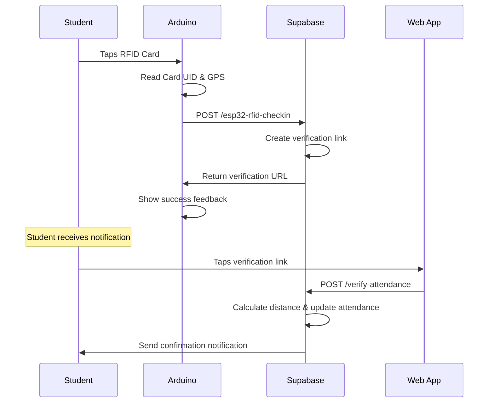

# Arduino Uno R4 WiFi Attendance System

This Arduino code integrates with your Supabase attendance system to handle RFID-based check-ins with GPS location verification.

## System Overview

1. **RFID Detection**: When a student taps their RFID card/tag
2. **Location Capture**: GPS coordinates are captured  
3. **Data Transmission**: Card ID and location sent to Supabase
4. **Verification Link**: System creates verification link for student
5. **Student Confirmation**: Student taps link on phone to confirm attendance

## Hardware Requirements

- Arduino Uno R4 WiFi
- MFRC522 RFID Reader Module
- GPS Module (NEO-6M or NEO-8M)
- Green LED + 220Ω resistor
- Red LED + 220Ω resistor  
- Passive Buzzer
- Breadboard and jumper wires

## API Endpoints Used

### 1. RFID Check-in Endpoint
```
POST https://epvggkmzbuudajceuaib.supabase.co/functions/v1/esp32-rfid-checkin
```

**Request Body:**
```json
{
  "esp32_device_id": "arduino_uno_r4_001",
  "student_rfid": "ABCD1234", 
  "latitude": 14.5995,
  "longitude": 120.9842
}
```

**Response:**
```json
{
  "success": true,
  "message": "RFID detected successfully",
  "student_name": "John Doe",
  "session": "Computer Science 101", 
  "verification_url": "https://...lovable.app/verify/token123",
  "expires_in_minutes": 5
}
```

### 2. Attendance Verification Endpoint  
```
POST https://epvggkmzbuudajceuaib.supabase.co/functions/v1/verify-attendance
```

**Request Body:**
```json
{
  "token": "verification-token-uuid",
  "student_latitude": 14.5995,
  "student_longitude": 120.9842  
}
```

This endpoint is called by the web app when student taps verification link.

## Setup Instructions

1. **Install Required Libraries** (see libraries_required.txt)

2. **Wire Hardware** according to connection diagram

3. **Configure Code:**
   ```cpp
   const char* ssid = "YOUR_WIFI_SSID";
   const char* password = "YOUR_WIFI_PASSWORD"; 
   const String ESP32_DEVICE_ID = "arduino_uno_r4_001";
   ```

4. **Upload Code** to Arduino Uno R4 WiFi

5. **Test System:**
   - Open Serial Monitor (115200 baud)
   - Wait for WiFi connection and GPS fix
   - Present RFID card to reader
   - Check Serial output for success/error messages

## System Flow



## LED Indicators

- **Green LED**: Successful operations, GPS fix acquired
- **Red LED**: Errors, no GPS fix warning
- **Both Off**: Standby mode

## Buzzer Patterns

- **Short beep**: Card detected
- **Happy tune**: Successful attendance submission  
- **Error tone**: Failed operation

## Database Integration

The Arduino interacts with these Supabase tables:

- `attendance_sessions` - Active class sessions
- `profiles` - Student information (matched by RFID)
- `verification_links` - Temporary verification tokens
- `attendance_records` - Final attendance status
- `attendance_notifications` - Student notifications

## Troubleshooting

### Common Issues

1. **WiFi Won't Connect**
   - Check SSID/password
   - Ensure signal strength
   - Try different network

2. **GPS No Fix**  
   - Move to open area with sky view
   - Wait 2-5 minutes for satellite acquisition
   - Check GPS module wiring

3. **RFID Not Reading**
   - Check MFRC522 wiring  
   - Test with different cards/tags
   - Ensure proper power supply

4. **HTTP Errors**
   - Verify internet connection
   - Check Supabase endpoint URLs
   - Monitor Serial output for error codes

### Serial Commands

Type in Serial Monitor for debugging:
- `status` - System status check
- `test` - Send test data  
- `gps` - Current GPS coordinates

## Security Notes

- Device ID should be unique per Arduino
- RFID UIDs are sent as-is (ensure cards are registered in system)
- GPS coordinates are sent over HTTPS
- Verification links expire after 5 minutes

## Location Verification

Students must be within **100 meters** of the Arduino's GPS location when they tap the verification link to be marked present. Distance is calculated using the Haversine formula.

For questions or issues, check the Serial Monitor output for detailed error messages.